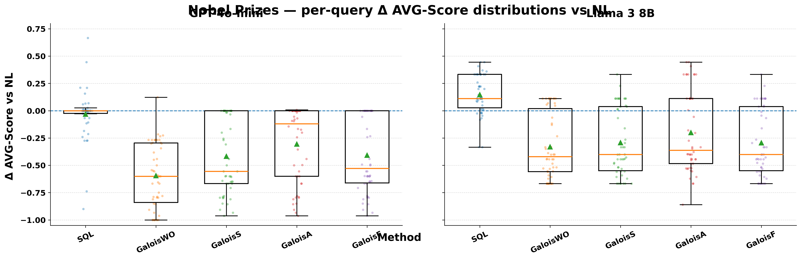
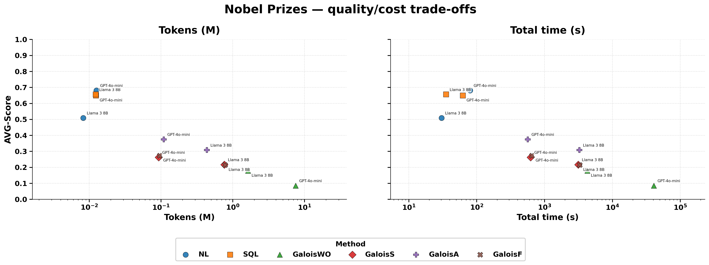
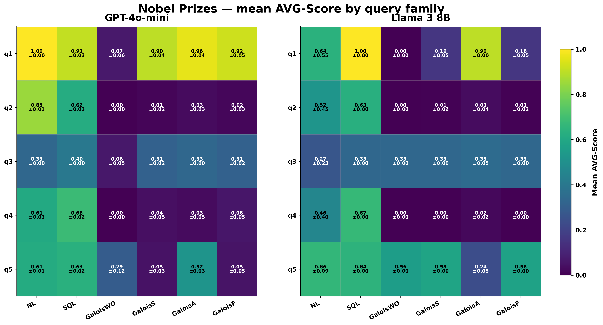
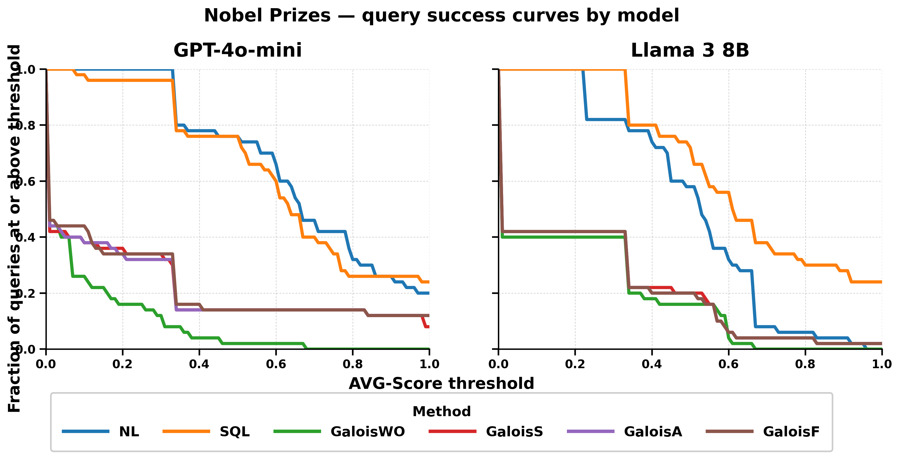
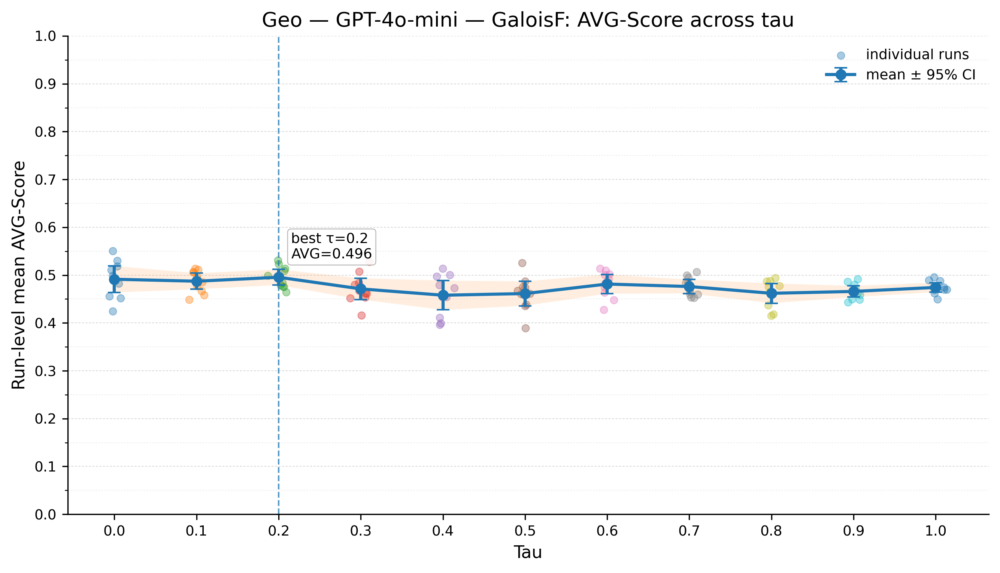

# SQL-over-LLMs Revisited: Reproducibility of Galois — Additional Material

This repository contains additional experimental material for the paper **“SQL-over-LLMs Revisited: Reproducibility of Galois”**. The material complements the main paper with results that could not be included in the camera-ready version for space reasons.

The focus of this repository is twofold. First, it reports the reproducibility analysis on the **Nobel Prizes** benchmark, a second parametric benchmark designed with the same rationale as the benchmark discussed in the paper: each query family is instantiated through multiple variants, so that the analysis can distinguish aggregate performance from query-family-level behavior. Second, it reports an additional **$\tau$-tuning** analysis for the full Galois configuration, used to check whether the physical scan-selection threshold materially changes the observed conclusions.

Overall, these additional results confirm the main findings of the paper. Direct prompting baselines remain very strong; Galois-style structured execution is not uniformly superior; optimized Galois variants are useful only in localized query families; and cost must be considered together with quality. The $\tau$-tuning experiment further suggests that, for the considered LLM backend, changing the confidence threshold does not substantially alter performance.

---

## Repository contents

```text
.
├── figures/
│   ├── delta_distribution_grid_vs_nl_nobel_prizes.png
│   ├── efficiency_tokens_time_scatter_nobel_prizes.png
│   ├── query_family_mean_heatmap_grid_nobel_prizes.png
│   ├── success_threshold_curve_all_models_nobel_prizes.png
│   └── tau_avg_score_curve_geo_GPT-4o-mini_galois_f.png
└── tables/
    ├── avg_barplot_table_nobel_prizes.tex
    ├── quality_profile_table_nobel_prizes_gpt4omini.tex
    └── quality_profile_table_nobel_prizes_llama38b.tex
```

The `figures/` directory contains the additional plots discussed below. The `tables/` directory contains the LaTeX tables used to summarize aggregate and quality-profile results on the Nobel Prizes benchmark.

---

## Experimental context

The Nobel Prizes benchmark is used as an additional reproducibility benchmark. It follows the same methodological motivation as the benchmark discussed in the paper: rather than evaluating a single query per information need, it groups related queries into families and instantiates each family through different predicate values. This makes it possible to observe whether a method is robust across semantically related queries or whether its apparent performance is driven by isolated successes.

The reported results compare the same family of execution strategies considered in the paper:

* `NL`: direct natural-language prompting;
* `SQL`: direct SQL prompting;
* `GaloisWO`: unoptimized structured execution;
* `GaloisS`: selectivity-inspired Galois optimization;
* `GaloisA`: all-pushdown Galois optimization;
* `GaloisF`: full confidence-guided Galois optimization.

The Nobel Prizes results are reported for **GPT-4o-mini** and **Llama 3 8B**. Quality is measured with the same metrics used in the paper: `F1-Cell`, `Cardinality`, `Tuple Constraint`, and their arithmetic mean, `AVG-Score`.

---

## Aggregate results on Nobel Prizes

The aggregate AVG-Score table is available in:

```text
tables/avg_barplot_table_nobel_prizes.tex
```

| Method   |   GPT-4o-mini |    Llama 3 8B |
| -------- | ------------: | ------------: |
| NL       | 0.681 (0.005) | 0.509 (0.344) |
| SQL      | 0.649 (0.007) | 0.656 (0.000) |
| GaloisWO | 0.085 (0.032) | 0.178 (0.000) |
| GaloisS  | 0.212 (0.012) | 0.204 (0.000) |
| GaloisA  | 0.211 (0.009) | 0.202 (0.000) |
| GaloisF  | 0.217 (0.011) | 0.202 (0.000) |

The aggregate picture is consistent with the conclusions of the paper. On GPT-4o-mini, `NL` and `SQL` are clearly stronger than the Galois variants, with `NL` reaching the best average score. On Llama 3 8B, `SQL` is the strongest method, while `NL` shows high variability. The structured Galois variants improve over `GaloisWO`, but they remain below the direct prompting baselines in aggregate quality.

This supports the same interpretation developed in the paper: Galois-style execution should not be understood as uniformly better than direct prompting. Its value is conditional on the query family, the model backend, and the quality/cost regime.

---

## Delta distributions against NL



This plot reports, for each model, the per-query difference in AVG-Score between each method and the `NL` baseline. The dashed horizontal line marks parity with `NL`. Points above zero indicate queries where a method outperforms direct natural-language prompting; points below zero indicate queries where it underperforms.

For GPT-4o-mini, `SQL` is close to `NL` on average but does not systematically dominate it. The Galois variants mostly lie below the `NL` baseline, indicating that structured execution tends to lose quality on this benchmark. For Llama 3 8B, `SQL` often improves over `NL`, while the Galois variants again tend to remain below the direct baseline.

The important observation is not only the average gap, but also the spread. Some queries benefit from alternative prompting or structured execution, while many others do not. This confirms that SQL-over-LLM behavior is query-dependent and that aggregate metrics can hide substantial per-query variability.

---

## Quality/cost trade-offs



This figure relates AVG-Score to execution cost, measured both in total token usage and total execution time. The best methods are those that appear toward the upper-left area of the plots: high quality with low token or time cost.

The Nobel Prizes results reinforce the cost-related conclusions of the paper. Direct `NL` and `SQL` prompting reach the highest quality scores while using substantially fewer tokens and less time than the structured Galois variants. The Galois methods, especially `GaloisWO`, can be much more expensive while producing lower aggregate quality.

This matters because the usefulness of SQL-over-LLM execution cannot be evaluated by quality alone. A structured plan may be attractive from a database-system perspective, but if it requires many additional LLM calls and does not improve result quality, the resulting quality/cost trade-off becomes unfavorable.

---

## Query-family behavior



The heatmap reports mean AVG-Score by query family, model, and method. This is the most informative plot for understanding where structured execution helps and where it fails.

For GPT-4o-mini, direct prompting dominates several families. `NL` is particularly strong on `q1` and `q2`, while `SQL` is also competitive across multiple families. The Galois variants show localized strengths, for example on `q1` and partially on `q3`, but they collapse on other families such as `q2` and `q4`.

For Llama 3 8B, `SQL` is especially robust on the first families and remains the strongest aggregate method. However, the heatmap also shows that Galois-style execution can be competitive in specific regions, especially on `q5`, where the structured variants obtain scores close to the direct baselines.

This supports one of the central claims of the paper: the value of structured execution is query-semantics-dependent rather than uniform. Galois-style decomposition is not generally superior, but it can still be useful for specific query families where the interaction between predicates, tuple retrieval, and post-processing is favorable.

---

## Success-threshold curves



The success-threshold curves show the fraction of queries whose AVG-Score is at or above a given threshold. They provide a robustness-oriented view of the results: a method is stronger if its curve remains high as the threshold increases.

On GPT-4o-mini, `NL` and `SQL` preserve a much larger fraction of successful queries across medium and high thresholds. The Galois curves drop earlier, meaning that structured execution produces fewer high-quality query results. On Llama 3 8B, `SQL` is the most robust method, while `NL` is competitive at lower thresholds but less stable overall. The Galois variants remain mostly concentrated in low-to-medium score regions.

These curves make explicit what the aggregate table already suggests: on the Nobel Prizes benchmark, direct prompting is not only better on average, but also more robust across quality thresholds.

---

## Quality profiles

The quality-profile tables are available in:

```text
tables/quality_profile_table_nobel_prizes_gpt4omini.tex
tables/quality_profile_table_nobel_prizes_llama38b.tex
```

For GPT-4o-mini, the direct baselines obtain much higher `F1-Cell` and `Cardinality` than the Galois variants. `NL` reaches the best aggregate score mainly because it combines strong cell-level correctness with very high cardinality. `SQL` is close in `F1-Cell` and slightly stronger in `Tuple Constraint`, but lower in cardinality.

For Llama 3 8B, `SQL` is the strongest method across the aggregate score and gives a more stable profile than `NL`, whose standard deviation is large. The Galois variants have lower tuple-level correctness and remain far from the direct baselines, although they improve over the unoptimized `GaloisWO` baseline in some dimensions.

The quality profiles therefore clarify why the aggregate results look the way they do. The main weakness of the Galois variants is not only final AVG-Score, but also the combination of incomplete tuple retrieval, weaker cell-level recall, and lower tuple reconstruction quality.

---

## Tau tuning



The $\tau$ parameter controls the confidence threshold used by the full Galois configuration (`GaloisF`) when selecting the physical scan strategy. Since this threshold can in principle affect the balance between `TableScan` and `KeyScan`, we evaluated whether tuning $\tau$ materially changes performance.

The tuning experiment was conducted on one of the original datasets, **Geo**, using **GPT-4o-mini** as the LLM backend and `GaloisF` as the execution mode. The tested values cover the full range from $\tau = 0.0$ to $\tau = 1.0$.

The curve shows that performance is largely stable across thresholds. The best observed value is $\tau = 0.2`, with an AVG-Score of approximately 0.496, but the differences across thresholds are small and the confidence intervals largely overlap. In practice, changing $\tau$ does not substantially alter the behavior of the system on the considered backend.

This result suggests that, at least for this model and dataset, the confidence threshold is not the main factor explaining the observed performance. The dominant sources of variation appear to be the LLM backend, prompt formulation, query semantics, tuple retrieval behavior, and parsing/post-processing pipeline. For this reason, the paper keeps $\tau$ fixed in the main experiments and treats prompt structure and query-family behavior as more relevant axes of analysis.

---

## How these additional results support the paper

The Nobel Prizes and $\tau$-tuning results reinforce the main conclusions of the paper.

First, direct prompting is a strong baseline. On Nobel Prizes, `NL` is strongest for GPT-4o-mini, while `SQL` is strongest for Llama 3 8B. This confirms that any SQL-over-LLM execution framework must be compared against carefully designed direct prompting baselines.

Second, Galois-style structured execution is not uniformly superior. The optimized variants improve over the unoptimized structured baseline, but they do not close the gap with direct prompting in aggregate quality.

Third, structured execution is query-family-dependent. The heatmaps show that Galois variants can be competitive in specific families, but they also fail almost completely in others. This supports a more nuanced interpretation: Galois is not a universal replacement for direct prompting, but a structured execution strategy whose usefulness depends on the query semantics.

Fourth, cost is central. The quality/cost scatter plot shows that structured execution may require substantially more tokens and time. When this additional cost is not matched by a quality improvement, the trade-off becomes unfavorable.

Finally, $\tau$ tuning does not change the overall picture. Although the best observed threshold in the Geo experiment is $\tau = 0.2`, the performance curve is nearly flat. This suggests that, for the considered backend, varying the confidence threshold is substantially less important than understanding prompt sensitivity, backend behavior, and query-family effects.

---

## Summary

This repository should be read as supporting material for the main reproducibility study. The Nobel Prizes benchmark confirms, in a second semantic domain, that the main findings of the paper are not specific to the Paintings benchmark. Direct baselines remain highly competitive, Galois-style execution remains sensitive and localized, and query-family analysis is necessary to interpret the results correctly. The $\tau$-tuning analysis further indicates that the physical confidence threshold is not, by itself, sufficient to recover the performance gap observed between direct prompting and structured execution.
